# Laporan Proyek Machine Learning - Chatarina Evangelista Sitorus

## Domain Proyek

Kanker paru-paru adalah penyakit yang memiliki tingkat mortalitas tinggi di seluruh dunia, terutama karena seringnya diagnosis baru ditemukan pada stadium lanjut. Gejala awal yang tidak spesifik serta ketergantungan pada metode deteksi invasif menjadi hambatan utama dalam skrining dan penanganan dini kanker paru.

Seiring dengan meningkatnya akses terhadap data kesehatan dan berkembangnya teknologi kecerdasan buatan, pendekatan berbasis machine learning (ML) mulai banyak digunakan dalam analisis risiko penyakit kronis, termasuk kanker paru-paru. ML menawarkan pendekatan non-invasif dan cepat dengan menganalisis data sederhana seperti usia, kebiasaan merokok, dan gejala awal.

Studi oleh **Chaturvedi et al. (2021)** menunjukkan bahwa berbagai teknik machine learning mampu memprediksi dan mengklasifikasikan kanker paru secara efektif menggunakan data gejala dan riwayat pasien. Penelitian lain oleh **Patra (2020)** juga membuktikan bahwa algoritma ML seperti Decision Tree dan Support Vector Machine dapat menghasilkan prediksi yang akurat hanya dengan input klinis dasar.

Sementara itu, **Gould et al. (2022)** menekankan bahwa data klinis rutin seperti riwayat pemeriksaan dan laboratorium dapat diintegrasikan dengan model pembelajaran mesin untuk meningkatkan akurasi identifikasi dini kanker paru-paru secara praktis di dunia nyata.

### Referensi

- Chaturvedi, P., Jhamb, A., Vanani, M., & Nemade, V. (2021). Prediction and classification of lung cancer using machine learning techniques. *IOP Conference Series: Materials Science and Engineering, 1099*(1), 012059. https://doi.org/10.1088/1757-899X/1099/1/012059
- Gould, M. K., Huang, B. Z., Tammemagi, M. C., Kinar, Y., & Shiff, R. (2022). Machine learning for early lung cancer identification using routine clinical and laboratory data. *American Journal of Respiratory and Critical Care Medicine, 205*(3), 350–352. https://doi.org/10.1164/rccm.202007-2791OC
- Patra, R. (2020). Prediction of lung cancer using machine learning classifier. In S. C. Satapathy, V. Bhateja, & S. Das (Eds.), *Data management, analytics and innovation* (pp. 107–120). Springer. https://doi.org/10.1007/978-981-15-6648-6_11  


## Business Understanding

Dalam upaya mendukung deteksi dini kanker paru-paru, proyek ini berfokus pada pengembangan sistem klasifikasi berbasis *machine learning* (ML) yang menggunakan data klinis non-invasif sebagai sumber utama informasi. ML dipilih karena kemampuannya dalam mengenali pola tersembunyi dari data sederhana seperti usia, kebiasaan merokok, dan gejala awal pasien, tanpa perlu bergantung pada metode diagnostik invasif atau mahal.

Berdasarkan latar belakang tersebut, maka proses klarifikasi masalah dan tujuan yang ingin dicapai dalam studi ini dirumuskan sebagai berikut:

### Problem Statements
1. Keterlambatan diagnosis kanker paru-paru sering terjadi akibat gejala awal yang tidak spesifik dan sulit dikenali, diperparah oleh keterbatasan akses terhadap metode deteksi dini konvensional yang mahal dan invasif.
2. Belum tersedianya sistem skrining awal yang cepat, efektif, dan hemat biaya berbasis data klinis non-invasif untuk membantu identifikasi individu berisiko tinggi kanker paru secara luas.
3. Terdapat kebutuhan untuk mengembangkan dan memvalidasi model prediktif menggunakan machine learning yang andal dan mampu mengklasifikasikan risiko kanker paru berdasarkan data klinis non-invasif, sebagai solusi atas keterbatasan metode deteksi saat ini.

### Goals
Dengan memanfaatkan machine learning, studi ini bertujuan untuk:
1. Memberikan dasar teknis untuk pengembangan sistem skrining awal kanker paru-paru berbasis data terbuka yang hemat biaya, informatif, dan mudah diakses.
2. Membangun model klasifikasi yang mampu memprediksi status kanker paru-paru berdasarkan fitur-fitur klinis dasar.
3. Membandingkan performa dua algoritma (Logistic Regression dan Random Forest Classifier) untuk memilih model klasifikasi yang paling andal dan efektif.

### Solution statements

- **Model 1: Logistic Regression**  
  Dipilih sebagai baseline model karena sifatnya yang cepat, sederhana, serta mudah diinterpretasikan. Cocok sebagai titik awal untuk evaluasi klasifikasi biner.

- **Model 2: Random Forest Classifier**  
  Merupakan model ansambel berbasis decision tree yang lebih kompleks dan mampu menangkap hubungan non-linear. Model ini juga relatif tahan terhadap overfitting.

Evaluasi kinerja model dilakukan dengan menggunakan metrik klasifikasi yang relevan: **Accuracy**, **Precision**, **Recall**, dan **F1-Score**. Visualisasi seperti confusion matrix dan grafik perbandingan juga digunakan untuk memberikan insight tambahan dalam pemilihan model terbaik.


## Data Understanding

Dataset yang digunakan dalam proyek ini berjudul **Lung Cancer Dataset** dan tersedia secara publik melalui platform Kaggle ([Lung Cancer Dataset](https://www.kaggle.com/datasets/akashnath29/lung-cancer-dataset)). Dataset ini terdiri dari **3000 entri pasien** dengan **15 fitur input** dan **1 kolom target** (`LUNG_CANCER`). Data bersifat **non-citra**, yaitu berdasarkan survei atau wawancara medis, sehingga cocok untuk diterapkan dalam sistem skrining awal berbasis data klinis.

### Struktur Dataset

Dataset dimuat menggunakan `pandas.read_csv()` dan memiliki struktur sebagai berikut:

```python
df_lung.shape
```

Output:
```
(3000, 16)
```

Artinya terdapat **3000 baris** (pasien) dan **16 kolom**, termasuk variabel target.

### Deskripsi Fitur

| **Fitur**               | **Deskripsi**                                      |
|-------------------------|----------------------------------------------------|
| `GENDER`                | Jenis kelamin pasien (M = Male, F = Female)        |
| `AGE`                   | Usia pasien dalam satuan tahun                     |
| `SMOKING`               | Status merokok (1 = Tidak, 2 = Ya)                 |
| `YELLOW_FINGERS`        | Ada/tidaknya noda kuning pada jari karena nikotin  |
| `ANXIETY`               | Riwayat gangguan kecemasan                         |
| `PEER_PRESSURE`         | Terpengaruh tekanan sosial dari lingkungan         |
| `CHRONIC_DISEASE`       | Memiliki penyakit kronis atau komorbiditas         |
| `FATIGUE`               | Mengalami kelelahan berkepanjangan                 |
| `ALLERGY`               | Riwayat alergi terhadap zat atau lingkungan tertentu |
| `WHEEZING`              | Napas berbunyi/mengi                               |
| `ALCOHOL_CONSUMING`     | Kebiasaan mengonsumsi alkohol                      |
| `COUGHING`              | Batuk kronis atau terus-menerus                    |
| `SHORTNESS_OF_BREATH`   | Sesak napas atau kesulitan bernapas                |
| `SWALLOWING_DIFFICULTY` | Sulit menelan makanan atau minuman                 |
| `CHEST_PAIN`            | Nyeri di bagian dada                              |
| `LUNG_CANCER`           | Target klasifikasi (YES = Kanker, NO = Tidak)      |


### Eksplorasi Data

Beberapa tahapan awal eksplorasi data dilakukan untuk memahami karakteristik dataset:

#### 1. Pemeriksaan Nilai Unik dan Duplikasi
Pemeriksaan nilai unik
```python
df_lung.nunique()
```
```python
Hasil:
Jumlah nilai unik di setiap kolom:
GENDER                    2
AGE                      51
SMOKING                   2
YELLOW_FINGERS            2
ANXIETY                   2
PEER_PRESSURE             2
CHRONIC_DISEASE           2
FATIGUE                   2
ALLERGY                   2
WHEEZING                  2
ALCOHOL_CONSUMING         2
COUGHING                  2
SHORTNESS_OF_BREATH       2
SWALLOWING_DIFFICULTY     2
CHEST_PAIN                2
LUNG_CANCER               2
dtype: int64
```
Pemeriksaan duplikasi
```python
df_lung.duplicated().sum()
```
Hasil: menunjukkan hanya terdapat **2 data duplikat** yang dapat dihapus.

#### 2. Pemeriksaan Struktur dan Tipe Data
Struktur data diperiksa menggunakan fungsi df.info() untuk melihat jumlah kolom, jumlah nilai non-null, serta tipe data masing-masing fitur.

```python
df_lung.info()
```
Hasil pemeriksaan menunjukkan:
  - Dataset terdiri dari 16 kolom, yaitu 14 kolom bertipe int64 dan 2 kolom bertipe object.
  - Kolom AGE merupakan data numerik kontinu.
  - Kolom-kolom seperti SMOKING, ANXIETY, COUGHING, dll. bertipe numerik diskrit (integer), dengan nilai 1 dan 2.
  - Kolom GENDER dan LUNG_CANCER bertipe kategorikal dengan nilai string (object).
  - Tidak ditemukan missing value pada dataset ini.

#### 3. Pemeriksaan Nilai Kosong (Missing Value)

Untuk memastikan bahwa dataset tidak memiliki nilai kosong (null) yang dapat menyebabkan error pada saat pelatihan model, dilakukan pengecekan sebagai berikut:

```python
print("Nilai null per kolom:")
print(df_lung.isna().sum())
```
```python
Output:

GENDER                   0
AGE                      0
SMOKING                  0
YELLOW_FINGERS           0
ANXIETY                  0
PEER_PRESSURE            0
CHRONIC_DISEASE          0
FATIGUE                  0
ALLERGY                  0
WHEEZING                 0
ALCOHOL_CONSUMING        0
COUGHING                 0
SHORTNESS_OF_BREATH      0
SWALLOWING_DIFFICULTY    0
CHEST_PAIN               0
LUNG_CANCER              0
```
Hasil menunjukkan bahwa tidak ada nilai kosong pada seluruh kolom dataset.

#### 4. Distribusi Data

##### Visualisasi Korelasi Awal

```python
sns.heatmap(df_lung.corr(numeric_only=True), annot=True)
```

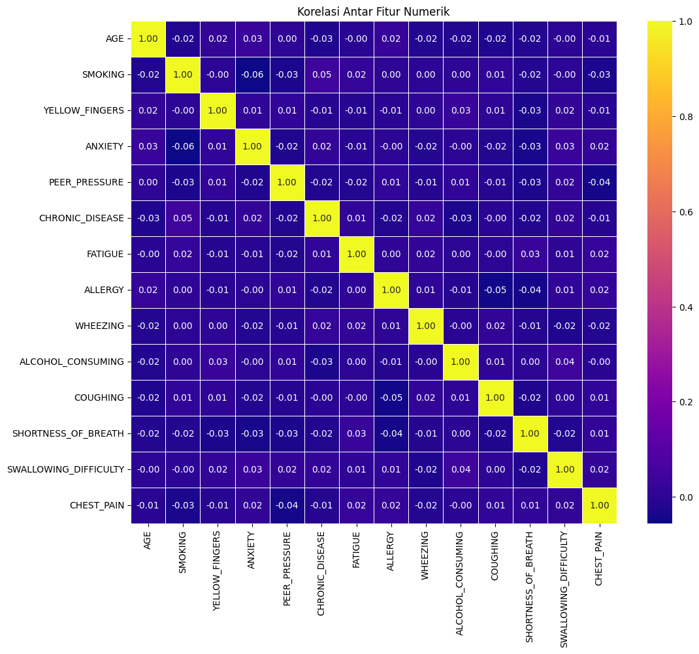

##### Deteksi Outlier dengan Boxplot (AGE)

```python
sns.boxplot(x=df_lung["AGE"])
```

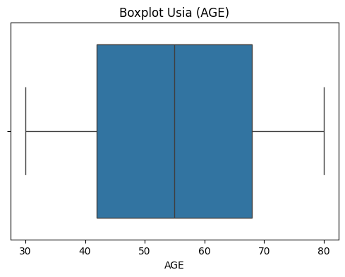

##### Distribusi Gender dan Label

```python
sns.countplot(x="GENDER", data=df_lung)
sns.countplot(x="LUNG_CANCER", data=df_lung)
```

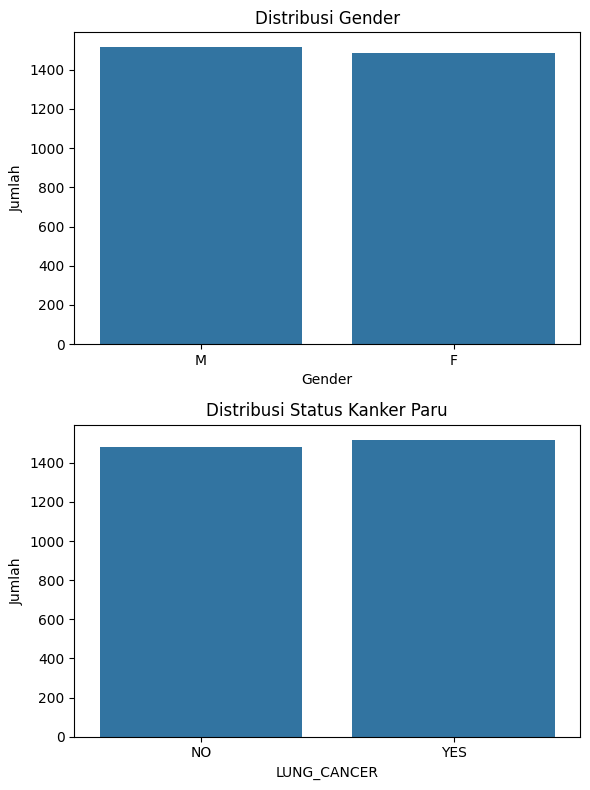


##### Distribusi Usia Pasien

```python
sns.histplot(data=df_lung, x="AGE", kde=True)
```

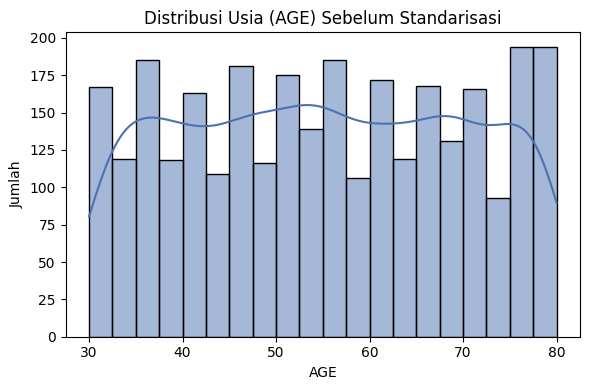

---

## Data Preparation

Proses *data preparation* dilakukan untuk memastikan bahwa data yang akan digunakan oleh model machine learning bersih, terstruktur, dan dalam format yang sesuai. Tahapan ini mencakup penghapusan data duplikat, encoding fitur kategorikal, remapping nilai biner, standarisasi fitur numerik, serta pembagian data menjadi data latih dan data uji.

### 1. Penghapusan Data Duplikat

Duplikasi data dapat menyebabkan bias dan menurunkan generalisasi model. Oleh karena itu, data duplikat dihapus terlebih dahulu:

```python
sebelum = df_processed.shape[0]
df_processed = df_processed.drop_duplicates()
setelah = df_processed.shape[0]
print(f"Data duplikat dihapus: {sebelum - setelah} baris.")
```
### 2. Remapping Nilai Biner

Beberapa fitur biner awalnya memiliki nilai 1 dan 2. Untuk menyeragamkan dan mempermudah proses pelatihan model, nilai-nilai tersebut diubah menjadi 0 dan 1.

```python
kolom_biner = [
    'SMOKING', 'YELLOW_FINGERS', 'ANXIETY', 'PEER_PRESSURE',
    'CHRONIC_DISEASE', 'FATIGUE', 'ALLERGY', 'WHEEZING',
    'ALCOHOL_CONSUMING', 'COUGHING', 'SHORTNESS_OF_BREATH',
    'SWALLOWING_DIFFICULTY', 'CHEST_PAIN'
]

df_processed[kolom_biner] = df_processed[kolom_biner].replace({1: 0, 2: 1})
```
### 3. Encoding Fitur Kategorikal

Fitur GENDER dan LUNG_CANCER adalah data kategorikal dengan nilai string, yang tidak dapat langsung digunakan dalam model. Oleh karena itu, dilakukan proses encoding menggunakan LabelEncoder.

```python
encoder = LabelEncoder()
for fitur in ['GENDER', 'LUNG_CANCER']:
    df_processed[fitur] = encoder.fit_transform(df_processed[fitur])
```
Nilai 'F' dan 'NO' akan dikodekan sebagai 0, sedangkan 'M' dan 'YES' sebagai 1.

### 4. Splitting Data (Train-Test Split)

Data kemudian dibagi menjadi dua bagian: data latih (80%) dan data uji (20%) untuk menghindari overfitting dan memungkinkan evaluasi yang objektif.


```python
X = df_processed.drop("LUNG_CANCER", axis=1)
y = df_processed["LUNG_CANCER"]

X_train, X_test, y_train, y_test = train_test_split(
    X, y, test_size=0.2, random_state=42
)
```
### 5. Standarisasi Fitur Numerik (AGE)

Karena AGE adalah satu-satunya fitur numerik kontinu, maka dilakukan standarisasi menggunakan StandardScaler agar skala nilainya setara dengan fitur lain (yang berupa biner 0/1).

Proses Standarisasi:
```python
scaler = StandardScaler()
X_train["AGE"] = scaler.fit_transform(X_train[["AGE"]])
X_test["AGE"] = scaler.transform(X_test[["AGE"]])
```
Statistik Fitur AGE Sebelum dan Sesudah Standarisasi

| Kondisi                 | Mean     | Std Dev   |
|-------------------------|----------|-----------|
| Sebelum Standarisasi    | 55.2143  | 14.7082   |
| Sesudah Standarisasi    | 0.0000   | 1.0002    |


### 6. Visualisasi Setelah Preprocessing
* Heatmap Korelasi (Setelah Preprocessing)
```python
sns.heatmap(df_processed.corr(numeric_only=True), annot=True, cmap="plasma")
```

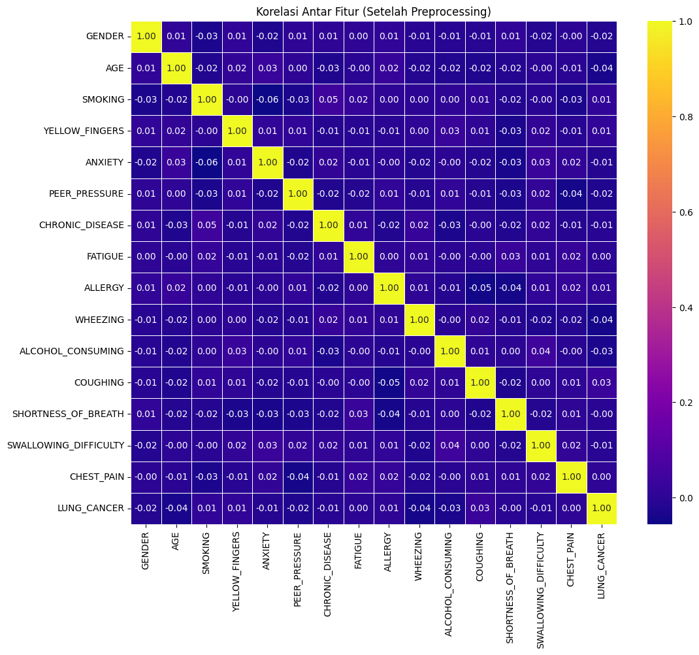

* Boxplot AGE
```python
sns.boxplot(x=X_train["AGE"])
```

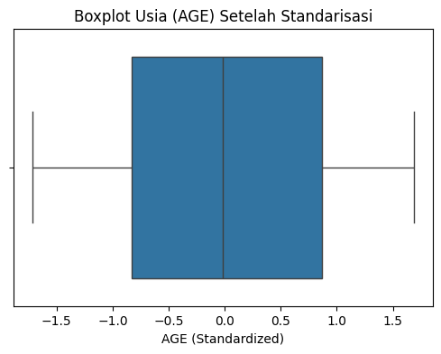

* Distribusi Gender & Status Kanker (Encoded)
```python
sns.countplot(x="GENDER", data=df_processed)
sns.countplot(x="LUNG_CANCER", data=df_processed)

```

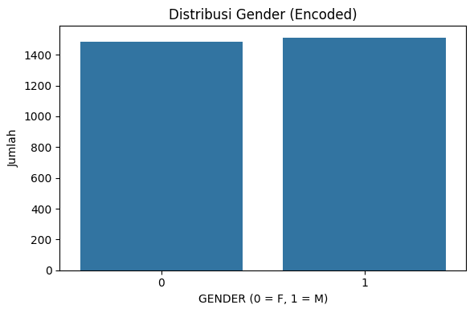  
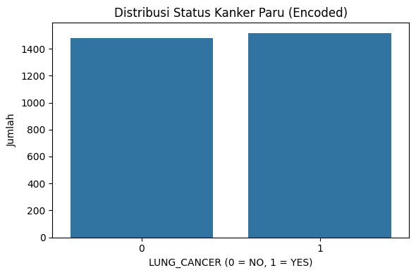 

* Distribusi AGE Setelah Standarisasi

```python
sns.histplot(data=X_train, x="AGE", kde=True, bins=20, color="#4C72B0")
```

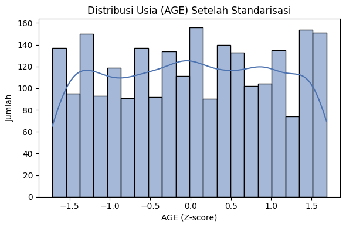

### Ringkasan Proses *Data Preparation*

| No | Tahapan                   | Keterangan                                                                                    |
|----|----------------------------|-----------------------------------------------------------------------------------------------|
| 1  | Penghapusan Duplikasi      | Menghapus 2 data duplikat dari dataset untuk menghindari bias pada pelatihan model.           |
| 2  | Remapping Nilai Biner      | Fitur biner yang awalnya bernilai 1 dan 2 dikonversi menjadi 0 dan 1 untuk konsistensi format.|
| 3  | Encoding Kategorikal       | Fitur `GENDER` dan `LUNG_CANCER` diubah menjadi angka menggunakan `LabelEncoder`.             |
| 4  | Train-Test Split           | Dataset dibagi menjadi 80% data latih dan 20% data uji agar evaluasi model lebih objektif.   |
| 5  | Standarisasi Numerik       | Fitur `AGE` distandarisasi menggunakan `StandardScaler` agar setara dengan fitur lain.        |
| 6  | Visualisasi Preprocessing  | Visualisasi hasil preprocessing seperti heatmap, boxplot, countplot, dan distribusi usia.     |


---

## Modeling

Tahapan ini membahas proses pemilihan, penerapan, dan konfigurasi algoritma machine learning yang digunakan untuk menyelesaikan permasalahan klasifikasi status kanker paru-paru. Dalam proyek ini digunakan dua model klasifikasi, yaitu **Logistic Regression** sebagai baseline dan **Random Forest Classifier** sebagai model ansambel yang lebih kompleks.

### 1. Pemilihan Model

Model dipilih berdasarkan karakteristik data yang bersifat tabular dan kategorikal, serta kebutuhan untuk mengeksplorasi perbandingan performa antara model sederhana dan model kompleks.

- **Logistic Regression**
  - Digunakan sebagai baseline model.
  - Sederhana, cepat, dan interpretatif.
  - Cocok untuk relasi linier antara fitur dan target.

- **Random Forest Classifier**
  - Model ansambel berbasis pohon keputusan.
  - Mampu menangkap pola non-linear.
  - Tahan terhadap overfitting dan cocok untuk data biner.


### 2. Implementasi dan Parameter Model

#### a) Model 1: Logistic Regression

Model ini dipilih sebagai **baseline classifier** karena memiliki karakteristik sebagai berikut:
- Cocok untuk masalah klasifikasi biner seperti prediksi kanker paru-paru (Yes/No).
- Cepat dan efisien dalam proses pelatihan.
- Mudah diinterpretasikan sehingga membantu dalam analisis fitur penting.
- Sering digunakan sebagai pembanding awal sebelum model yang lebih kompleks.
  
```python
from sklearn.linear_model import LogisticRegression

logreg_model = LogisticRegression(max_iter=10000, random_state=42)
logreg_model.fit(X_train, y_train)
y_pred_logreg = logreg_model.predict(X_test)
```

**Parameter yang digunakan:**
- `max_iter = 10000`: Untuk memastikan model konvergen saat training.
- `random_state = 42`: Agar hasil dapat direproduksi.

#### b) Model 2: Random Forest Classifier
Model ini digunakan untuk mengeksplorasi alternatif dengan **kompleksitas dan performa lebih tinggi**. Random Forest merupakan model ansambel yang mampu:

- Menangkap hubungan non-linear antar fitur.
- Lebih tahan terhadap overfitting dibanding pohon keputusan tunggal.
- Memberikan akurasi yang lebih baik pada data klasifikasi tabular dengan fitur biner dan numerik.

```python
from sklearn.ensemble import RandomForestClassifier

rf_model = RandomForestClassifier(n_estimators=100, random_state=42, n_jobs=-1)
rf_model.fit(X_train, y_train)
y_pred_rf = rf_model.predict(X_test)
```

**Parameter yang digunakan:**
- `n_estimators = 100`: Jumlah pohon dalam hutan.
- `random_state = 42`: Konsistensi hasil training.
- `n_jobs = -1`: Memaksimalkan penggunaan CPU.


### 3. Kelebihan dan Kekurangan Model

| Model               | Kelebihan                                                           | Kekurangan                                  |
|---------------------|---------------------------------------------------------------------|---------------------------------------------|
| Logistic Regression | Cepat, efisien, mudah dipahami dan dijadikan baseline              | Kurang fleksibel dalam menangkap pola non-linear |
| Random Forest       | Akurasi tinggi, tahan overfitting, bisa menangkap relasi kompleks  | Komputasi lebih berat, sulit diinterpretasi |

---

### 4. Pemilihan Model Terbaik

Setelah dilakukan evaluasi pada bagian selanjutnya, diperoleh bahwa **Random Forest Classifier memiliki performa yang lebih tinggi** dibandingkan Logistic Regression pada seluruh metrik evaluasi utama: akurasi, presisi, recall, dan F1-score.

Meskipun Logistic Regression unggul dari segi interpretasi dan efisiensi komputasi, **Random Forest dipilih sebagai model final** dalam proyek ini karena:

- Lebih akurat dalam menangani data dengan hubungan fitur yang kompleks.
- Mampu mengurangi risiko overfitting.
- Mampu bekerja optimal tanpa banyak preprocessing atau asumsi data linier.

---

## Evaluation

Tahapan evaluasi bertujuan untuk menilai performa model klasifikasi yang telah dibangun menggunakan data uji. Empat metrik utama yang digunakan dalam proyek ini adalah **Accuracy**, **Precision**, **Recall**, dan **F1-Score**. Setiap metrik mencerminkan dimensi performa yang berbeda, penting untuk memahami kekuatan dan kelemahan masing-masing model.

### 1. Penjelasan Metrik Evaluasi

| Metrik     | Deskripsi |
|------------|-----------|
| **Accuracy** | Proporsi prediksi benar dari seluruh prediksi. |
| **Precision** | Proporsi prediksi positif yang benar-benar positif. |
| **Recall** | Proporsi data positif yang berhasil diprediksi dengan benar. |
| **F1-Score** | Harmonik rata-rata Precision dan Recall, berguna pada data yang tidak seimbang. |

### Rumus Metrik Evaluasi

Metrik yang digunakan dalam proyek ini dapat dihitung menggunakan rumus-rumus berikut:

- **Accuracy**  
  Mengukur proporsi prediksi yang benar terhadap seluruh prediksi.  
  `Accuracy = (TP + TN) / (TP + TN + FP + FN)`

- **Precision**  
  Mengukur ketepatan prediksi kelas positif.  
  `Precision = TP / (TP + FP)`

- **Recall (Sensitivity)**  
  Mengukur seberapa banyak kelas positif yang berhasil terdeteksi.  
  `Recall = TP / (TP + FN)`

- **F1-Score**  
  Rata-rata harmonik dari Precision dan Recall. Cocok digunakan jika data tidak seimbang.  
  `F1-Score = 2 * (Precision * Recall) / (Precision + Recall)`

#### Keterangan:
- **TP**: True Positive  
- **TN**: True Negative  
- **FP**: False Positive  
- **FN**: False Negative


### 2. Hasil Evaluasi Model

#### Logistic Regression

```python
📊 Evaluasi Model Logistic Regression
Accuracy     : 0.4967
Precision    : 0.4966
Recall       : 0.4967
F1-Score     : 0.4956
```

#### Random Forest Classifier

```python
📊 Evaluasi Model Random Forest
Accuracy     : 0.5367
Precision    : 0.5367
Recall       : 0.5367
F1-Score     : 0.5365
```


### 3. Visualisasi Confusion Matrix

Confusion Matrix Logistic Regression dan Random Forest
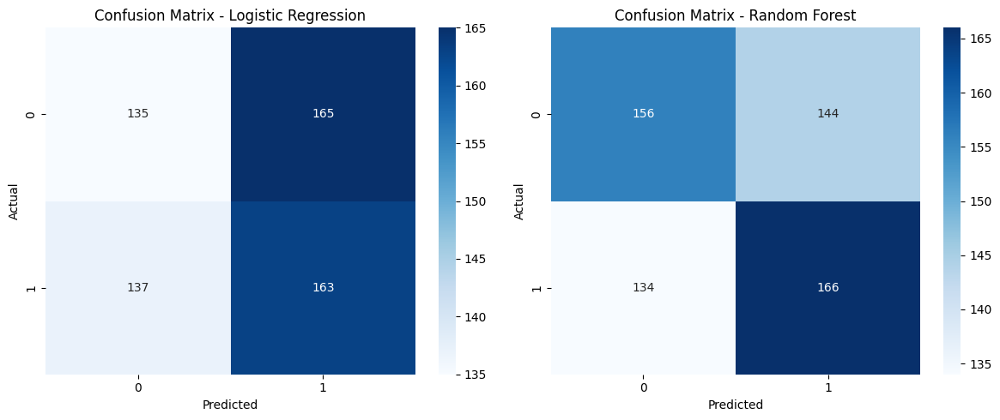


### 4. Visualisasi Perbandingan Akurasi

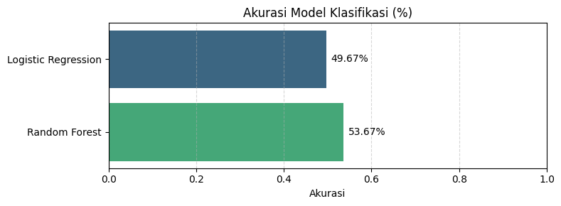


### 5. Tabel Ringkasan Hasil

| Model                | Accuracy | Precision | Recall | F1-Score |
|----------------------|----------|-----------|--------|----------|
| Logistic Regression  | 0.4967   | 0.4966    | 0.4967 | 0.4956   |
| Random Forest        | 0.5367   | 0.5367    | 0.5367 | 0.5365   |


### 6. Analisis dan Kesimpulan

Hasil evaluasi menunjukkan bahwa model **Random Forest Classifier** memberikan performa yang lebih baik dibandingkan **Logistic Regression** pada semua metrik evaluasi. Hal ini konsisten dengan karakteristik model yang mampu menangkap hubungan non-linear dan interaksi antar fitur.

Meskipun demikian, **akurasi kedua model masih di bawah 60%**, yang menunjukkan bahwa prediksi kanker paru-paru berbasis data klinis sederhana memiliki keterbatasan.

**Beberapa penyebab potensial:**

- Tidak dilakukan hyperparameter tuning atau cross-validation.
- Fitur-fitur yang digunakan bersifat umum dan mungkin kurang informatif untuk deteksi kanker.
- Distribusi label relatif seimbang namun terdapat noise atau ketidaksesuaian data input.

**Langkah selanjutnya yang direkomendasikan:**

- Melakukan tuning hyperparameter untuk Random Forest.
- Mencoba metode balancing jika ditemukan distribusi label tidak seimbang.
- Menambah fitur klinis yang lebih relevan (misalnya hasil CT scan, biomarker, dsb).
- Mengevaluasi model dengan teknik validasi silang (cross-validation).


